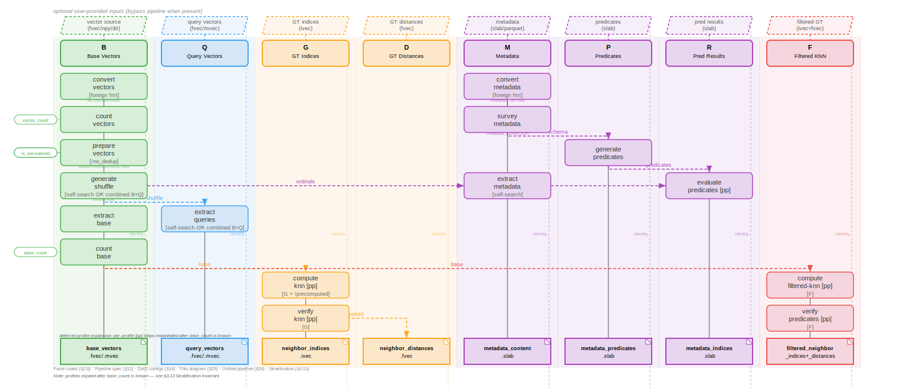

<!-- Copyright (c) Jonathan Shook -->
<!-- SPDX-License-Identifier: Apache-2.0 -->

# 15 — Facet Swimlane Diagram

The pipeline superset graph viewed as a swimlane diagram. Each facet
code occupies its own vertical lane. Steps flow top-to-bottom. Cross-lane
arrows show data dependencies. Every step is annotated with its activation
condition — to derive any specific pipeline configuration, remove steps
whose conditions are not met.

This single diagram is the canonical representation of all possible
pipeline shapes. The 18 configurations in SRD §14 are specific
activations of this superset.

---

## 15.1 Reading the Diagram

- **Each column is a facet lane** (B, Q, G, D, M, P, R, F)C
- **Steps flow top-to-bottom** within their primary lane
- **`──→`** arrows show cross-lane data dependencies
- **`[when: ...]`** tags show the activation condition for each step
- **`[pp]`** means per-profile (executed once per sized profile + default)
- **`(identity)`** means the step collapses to a symlink when its
  condition is met (no work, just path aliasing)
- Steps without a `[when:]` tag are always present when their lane is active

To derive a specific configuration: start with the active facet set
(e.g., `BQGD`), activate only the lanes in that set, then remove any
step whose `[when:]` condition is not satisfied.

---

## 15.2 Unified Swimlane

**Generator**: `cargo run -p tools --bin gen_swimlane > docs/design/diagrams/15-facet-swimlane.svg`
**Source**: [`tools/src/bin/gen_swimlane.rs`](../../tools/src/bin/gen_swimlane.rs)
**Rendered**: [`diagrams/15-facet-swimlane.svg`](diagrams/15-facet-swimlane.svg)



<details>
<summary>ASCII approximation (for terminals without image rendering)</summary>

```
 B (Base)          Q (Query)        G (GT Idx)       D (GT Dist)      M (Metadata)     P (Predicates)   R (Pred Idx)     F (Filtered)
 ════════════════  ════════════════  ═══════════════  ═══════════════  ═══════════════  ═══════════════  ═══════════════  ═══════════════

 ┌──────────────┐                                                     ┌──────────────┐
 │   convert    │                                                     │   convert    │
 │   vectors    │                                                     │   metadata   │
 │ (identity if │                                                     │ (identity if │
 │  native xvec)│                                                     │  native slab)│
 │[when: foreign│                                                     │[when: foreign│
 │  source fmt] │                                                     │  source fmt] │
 │[fraction: op]│                                                     └──────┬───────┘
 └──────┬───────┘                                                            │
        │                                                          ┌─────────┼──────────────────────────────────┐
        │                                                          │         │                                  │
 ┌──────┴───────┐                                             ┌────┴───────┐ │                                  │
 │    count     │                                             │   survey   │ │                                  │
 │   vectors    │                                             │  metadata  │ │                                  │
 └──────┬───────┘                                             └────┬───────┘ │                                  │
        │                                                          │         │                                  │
 ┌──────┴───────┐                                                  │         │                           ┌──────┴───────┐
 │  sort+dedup  │                                                  │         │                           │   generate   │
 │              │                                                  └─────────┼──────────────────────────→│  predicates  │
 │[when: !no   ]│                                                            │                           └──────┬───────┘
 │[     dedup  ]│                                                            │                                  │
 └──────┬───────┘                                                            │                                  │
        │                                                                    │                                  │
 ┌──────┴───────┐                                                            │                                  │
 │  find-zeros  │                                                            │                                  │
 │              │                                                            │                                  │
 │[when: !no   ]│                                                            │                                  │
 │[  zero_check]│                                                            │                                  │
 └──────┬───────┘                                                            │                                  │
        │                                                                    │                                  │
 ┌──────┴───────┐                                                            │                                  │
 │    filter    │                                                            │                                  │
 │   ordinals   │                                                            │                                  │
 │              │                                                            │                                  │
 │[when: sort  ]│                                                            │                                  │
 │[ OR zeros   ]│                                                            │                                  │
 └──────┬───────┘                                                            │                                  │
        │                                                                    │                                  │
 ┌──────┴───────┐                                                            │                                  │
 │   compute    │                                                            │                                  │
 │   base-end   │                                                            │                                  │
 │              │                                                            │                                  │
 │[when: frac  ]│                                                            │                                  │
 │[    < 1.0   ]│                                                            │                                  │
 └──────┬───────┘                                                            │                                  │
        │                                                                    │                                  │
 ┌──────┴───────┐                                                            │                                  │
 │   generate   │                                                            │                                  │
 │   shuffle    │──────ordinals──────────────────────────────────────────────→│                                  │
 │              │                                                      ┌─────┴────────┐                         │
 │[when: Q +   ]│                                                      │   extract    │                         │
 │[ self-search]│                                                      │   metadata   │←────────────────────────┤
 └──────┬──┬───┘                                                      │              │                         │
        │  │                                                           │[when: self  ]│                         │
        │  └────────────────┐                                          │[    -search ]│                         │
        │                   │                                          └──────┬───────┘                         │
 ┌──────────────┐    ┌──────────────┐                                        │                           ┌──────────────┐
 │   extract    │    │   extract    │                                        │                           │   evaluate   │
 │    base      │    │   queries    │                                        │                           │  predicates  │
 │              │    │              │                                        └──────────────────────────→│     [pp]     │
 │[when: Q +   ]│    │[when: Q +   ]│                                                                   └──────┬───────┘
 │[ self-search]│    │[ self-search]│                                                                          │
 └──────┬───────┘    └──────┬───────┘                                                                          │
        │                   │                                                                                  │
 ┌──────┴───────┐           │                                                                                  │
 │    count     │           │                                                                                  │
 │     base     │           │                                                                                  │
 └──────┬───────┘           │                                                                                  │
        │                   │                                                                                  │
        │    ┌──────────────┘                                                                                  │
        │    │                                                                                                 │
        │    │           ┌──────────────┐  ┌──────────────┐                                                    │
        ├────┼──────────→│   compute    │  │   (paired)   │                                                    │
        │    ├──────────→│     knn      │─→│  distances   │                                                    │
        │    │           │    [pp]      │  │              │                                                    │
        │    │           │[when: G +   ]│  │[when: D]    │                                                    │
        │    │           │[!precomputed]│  │              │                                                    │
        │    │           └──────┬───────┘  └──────┬───────┘                                                    │
        │    │                  │                  │                                                            │
        │    │           ┌──────┴───────┐          │                                                    ┌──────┴───────┐
        │    │           │   verify     │          │                                                    │   compute    │
        │    │           │     knn      │          │                                                    │ filtered-knn │
        │    │           │    [pp]      │          │                                                    │    [pp]      │
        │    │           │[when: G]     │          │                                                    │[when: F]     │
        │    │           └──────┬───────┘          │                                                    └───┬──────┬───┘
        │    │                  │                  │                                                        │      │
        │    │                  │                  │                                                 ┌──────┘      └──────┐
        │    │                  │                  │                                                 │                    │
        │    │                  │                  │                                          ┌──────┴───────┐             │
        │    │                  │                  │                                          │    verify    │             │
        │    │                  │                  │                                          │  predicates  │             │
        │    │                  │                  │                                          │    [pp]      │             │
        │    │                  │                  │                                          │[when: F]     │             │
        │    │                  │                  │                                          └──────┬───────┘             │
        │    │                  │                  │                                                 │                    │
 ═══════╪════╪══════════════════╪══════════════════╪═══════════════════════════════════════════════════╪════════════════════╪══════
        │    │                  │                  │                                                 │                    │
        ▼    ▼                  ▼                  ▼                  ▼              ▼                ▼                    ▼
 ╔══════════════╗  ╔══════════════╗  ╔══════════════╗  ╔══════════════╗  ╔══════════════╗  ╔══════════════╗  ╔══════════════╗  ╔══════════════╗
 ║     B        ║  ║     Q        ║  ║     G        ║  ║     D        ║  ║     M        ║  ║     P        ║  ║     R        ║  ║     F        ║
 ║  base_       ║  ║  query_      ║  ║  neighbor_   ║  ║  neighbor_   ║  ║  metadata_   ║  ║  metadata_   ║  ║  metadata_   ║  ║  filtered_   ║
 ║  vectors     ║  ║  vectors     ║  ║  indices     ║  ║  distances   ║  ║  content     ║  ║  predicates  ║  ║  indices     ║  ║  neighbor_*  ║
 ║  .fvec/.mvec ║  ║  .fvec/.mvec ║  ║  .ivec       ║  ║  .fvec       ║  ║  .slab       ║  ║  .slab       ║  ║  .slab       ║  ║  .ivec/.fvec ║
 ╚══════════════╝  ╚══════════════╝  ╚══════════════╝  ╚══════════════╝  ╚══════════════╝  ╚══════════════╝  ╚══════════════╝  ╚══════════════╝

 ════════════════════════════════════════════════════════════════════════════════════════════════════════════════════════════════════════════════
                                                       FINALIZATION (always)

              ┌──────────────────────────────────────────────────────────────────────────────────────────────────────────────────┐
              │                                    generate-catalog + generate-merkle                                           │
              │                              [after: all verify steps complete]                                                 │
              └──────────────────────────────────────────────────────────────────────────────────────────────────────────────────┘
```

</details>

---

## 15.3 Step Activation Reference

Every step in the swimlane, its lane, and its activation condition:

| Step | Lane | Active when | Identity when |
|------|------|-------------|---------------|
| convert-vectors | B | B + foreign source format | native xvec (symlinked) |
| subset-vectors | B | B + fraction < 1.0 + native xvec + !pedantic | fraction = 1.0, or foreign fmt, or pedantic |
| count-vectors | B | B | — |
| sort+dedup | B | B + !no_dedup | no_dedup |
| find-zeros | B | B + !no_zero_check | no_zero_check |
| filter-ordinals | B | B + (sort OR zeros) | neither sort nor zeros |
| compute-base-end | B | B + fraction < 1.0 + pedantic | fraction = 1.0, or fast mode (subset already applied) |
| generate-shuffle | B→Q | Q + self-search | separate query file |
| extract-queries | Q | Q + self-search | separate query file (symlinked) |
| extract-base | B | Q + self-search | not self-search (symlinked) |
| count-base | B | Q + self-search | — |
| convert-metadata | M | M + foreign source format | native slab |
| survey-metadata | M→P | M | — |
| extract-metadata | M | M + self-search | not self-search |
| generate-predicates | P | M | — |
| evaluate-predicates | R | M [pp] | — |
| compute-knn | G | G + !pre-computed [pp] | GT provided |
| (distances) | D | D + compute-knn active | GT distances provided |
| verify-knn | G | G [pp] | — |
| compute-filtered-knn | F | F [pp] | — |
| (filtered distances) | F | F + filtered-knn active | — |
| verify-predicates | F | F [pp] | — |
| generate-catalog | — | always | — |
| generate-merkle | — | always | — |

---

## 15.4 Deriving a Configuration

To derive the DAG for a specific `--required-facets` value:

1. **Activate lanes**: only lanes whose facet code is in the set
2. **Activate steps**: within each active lane, include steps whose
   `[when:]` condition is satisfied by the CLI flags
3. **Prune edges**: remove cross-lane arrows that target inactive lanes
4. **Identity collapse**: steps whose identity condition is met become
   pass-through (no pipeline step emitted, artifact = upstream path)

### Example: `--required-facets BQGD` (no metadata)

Active lanes: B, Q, G, D. Inactive: M, P, R, F.

Steps included:
- B: convert-vectors, count-vectors, sort+dedup, find-zeros,
  filter-ordinals, generate-shuffle, extract-base, count-base
- Q: extract-queries
- G: compute-knn, verify-knn
- D: (paired with G)

Steps excluded:
- All M, P, R, F lane steps
- compute-base-end (fraction = 1.0)

### Example: `--required-facets B` (base only)

Active lanes: B only. Steps: convert-vectors, count-vectors,
sort+dedup, find-zeros, filter-ordinals. No shuffle, no extraction,
no KNN.

### Example: `--required-facets BQGDMPRF` + `--no-dedup` + `--base-fraction '50%'`

All lanes active. Within B lane: sort+dedup is elided (no_dedup),
compute-base-end is active (fraction < 1.0). Within Q lane:
shuffle and extract steps active (self-search). All M/P/R/F lane
steps active.

---

## 15.5 Cross-Lane Data Flow Summary

```
B ──shuffle──→ Q         Shuffle ordinals → query/base extraction
B ──shuffle──→ M         Same shuffle → metadata extraction (ordinal congruency)
B ──base───→ G,D        Base vectors → KNN corpus
Q ──query──→ G,D        Query vectors → KNN input
B ──base───→ F          Base vectors → filtered KNN corpus
Q ──query──→ F          Query vectors → filtered KNN input
M ──survey─→ P          Schema → predicate synthesis
M ──meta───→ R          Metadata → predicate evaluation
P ──preds──→ R          Predicates → evaluation input
R ──indices→ F          Predicate results → filtered KNN pre-filter
```

The **ordinal congruency invariant** (SRD §12.1) is maintained by
the B→Q and B→M edges sharing the same shuffle permutation. The
shuffle reads `clean_ordinals.ivec` directly, so its output contains
actual source ordinals with duplicates and zeros already excluded.

---

## 15.6 Relationship to Other Documents

- **SRD §2.8**: Defines the facet codes (BQGDMPRF) and inference rules
- **SRD §12**: Defines the slot model, resolution rules, and Mermaid
  flowchart (§12.4). The swimlane is an alternative spatial layout of
  the same graph with lane-based organization.
- **SRD §14**: Enumerates 18 specific configurations as test cases.
  Each is a specific activation of this swimlane.
