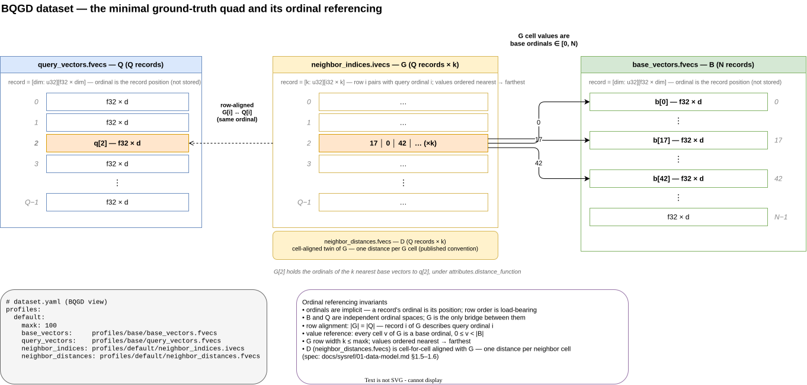
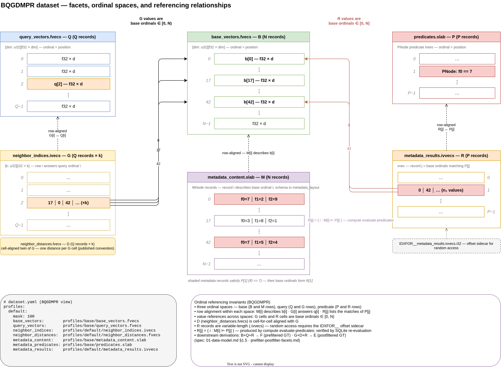
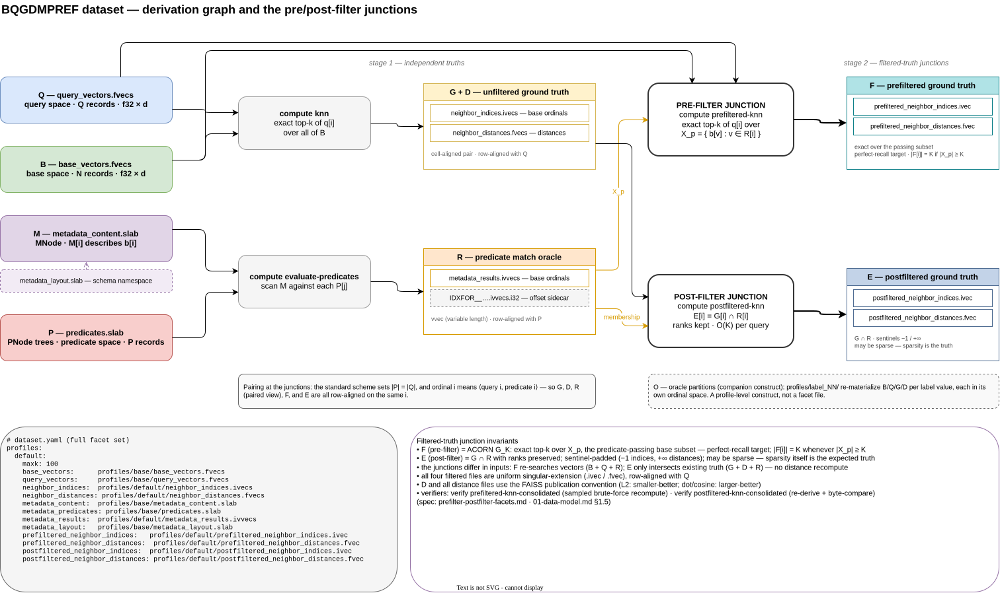

# Dataset Anatomy — Three Views of the Facet Model

This document walks the facet model of a ground-truth test dataset in three
diagrams of increasing scope. Each level adds facets and relationships while
keeping the visual language of the previous one, so the progression itself
teaches the model: first *how ordinal referencing works at all*, then *how
multiple ordinal spaces coexist*, and finally *how every facet derives from
the others* — including the two junction points where filtered ground truth
is born.

Authority for everything shown here:
[`../sysref/01-data-model.md`](../sysref/01-data-model.md) §1.5–1.7 (facets,
layout, dataset.yaml) and
[`prefilter-postfilter-facets.md`](prefilter-postfilter-facets.md) (F/E
semantics). Each diagram is available as an editable `.drawio` source; the
`.drawio.svg` and `.drawio.png` renders embed the diagram XML, so opening
either in draw.io recovers the editable diagram.

Reading conventions shared by all three levels:

- **Colors are facet families** — Q blue, B green, G/D yellow, M purple,
  P red, R orange, F teal, E slate — and stay consistent across levels.
- **Gray italic chips are ordinals.** They sit *outside* the record boxes
  because ordinals are implicit: a record's ordinal is its position in the
  file, never a stored value. Row order is load-bearing.
- **Dashed edges are row alignment** (same ordinal, by position).
  **Solid edges are value references** (a cell's *value* is an ordinal in
  another file). The distinction between these two mechanisms is the entire
  ordinal-referencing model.

---

## Level 1 — facets-BQGD: the minimal ground-truth quad

The smallest dataset that can support recall testing is four files: base
vectors **B**, query vectors **Q**, neighbor indices **G**, and neighbor
distances **D** — D being the cell-aligned twin of G, one published-convention
distance per neighbor cell. This view
shows the two referencing mechanisms on a worked example (query 2):

- **Row alignment**: record *i* of G answers query ordinal *i* — the dashed
  link. Nothing in the bytes says so; the pairing is purely positional.
- **Value reference**: the cells of `G[2]` — `17 │ 0 │ 42` — are *base
  ordinals*, each naming a record in B by position. B and Q are independent
  ordinal spaces; G is the only bridge between them.

The invariants panel is the contract a consumer can rely on: `|G| = |Q|`,
every G value in `[0, N)`, k ≤ maxk with values ordered nearest→farthest,
and D cell-for-cell aligned with G.

*Source: [`facets-BQGD.drawio`](diagrams/facets-BQGD.drawio)*

---

## Level 2 — facets-BQGDMPR: three ordinal spaces

Adding the predicated-search facets — metadata **M**, predicates **P**, and
predicate results **R** — turns the two ordinal spaces of Level 1 into
three, each a column pair in the diagram:

- **Query space** (Q, G, and D rows) — unchanged from Level 1.
- **Base space** (B and M rows) — M is row-aligned with B: `M[i]` holds the
  metadata fields describing `b[i]`. One shuffle order governs both.
- **Predicate space** (P and R rows) — R is row-aligned with P: `R[j]` is
  the variable-length list of base ordinals whose metadata satisfies
  `P[j]`. Being variable-length (`.ivvecs`), R needs the `IDXFOR__` offset
  sidecar for random access.

Value references still all point one way: into base space. The worked
example continues from Level 1 and adds `P[1] = (f0 == 7)`; the shaded M
records (ordinals 0 and 42) are the ones satisfying it, and their ordinals
*are* the contents of `R[1]`. The example deliberately overlaps with G[2]'s
values — b[0] and b[42] are both near q[2] *and* pass the predicate — which
is exactly the intersection the E facet will formalize at Level 3.

*Source: [`facets-BQGDMPR.drawio`](diagrams/facets-BQGDMPR.drawio)*

---

## Level 3 — facets-BQGDMPREF: the complete facet set and the filtered-truth junctions

The final view zooms out from rows to the derivation graph over all facets,
organized as a two-stage pipeline. Stage 1 computes two *independent*
truths: `compute knn` turns B+Q into the unfiltered ground truth pair
**G+D**, while `compute evaluate-predicates` turns M+P into the match
oracle **R**. Neither computation knows the other exists.

Stage 2 is where the vector side and the predicate side meet — at two
junctions with deliberately different characters:

- **The pre-filter junction** (vectors + predicates → **F**):
  `compute prefiltered-knn` re-searches the vectors, exactly, over the
  passing subset `X_p = { b[v] : v ∈ R[i] }`. F is the perfect-recall
  target — `|F[i]| = K` whenever `|X_p| ≥ K` — and the right oracle for
  engines that pre-filter then search.
- **The post-filter junction** (ground truth + predicates → **E**):
  `compute postfiltered-knn` never touches a vector. `E[i] = G[i] ∩ R[i]`,
  ranks preserved, sentinel-padded (−1 indices, +∞ distances), O(K) per
  query. E may be sparse — and that sparsity is itself the expected truth
  for engines that search first and filter afterward.

The asymmetry is the lesson of this level: F's inputs come from the raw
vector side (expensive re-search), E's from already-computed truth (cheap
intersection). Both junctions are well-defined per-row because of the
pairing rule — the standard scheme sets `|P| = |Q|`, so ordinal *i* means
⟨query *i*, predicate *i*⟩ across G, D, R, F, and E alike. The schema
sidecar (`metadata_layout`) and the O oracle partitions (a profile-level
construct, not a facet file) complete the inventory.

*Source: [`facets-BQGDMPREF.drawio`](diagrams/facets-BQGDMPREF.drawio)*

---

## Where to go next

- Byte-level formats behind every box: `01-data-model.md` §1.1–1.4
  (xvec/vvec structures, MNode/PNode wire formats, slab containers).
- F/E design rationale and consumer impact: `prefilter-postfilter-facets.md`
  §7 — which consumers must distinguish E from F.
- Building a dataset with all of these facets end-to-end:
  [`../tutorials/build-predicated-dataset.md`](../tutorials/build-predicated-dataset.md);
  a complete worked instance lives at
  `../tutorials/vecd-end-to-end/vecd-demo/work/toy/`.
- Verification of each derived facet: `verify knn-consolidated`,
  `verify predicates-sqlite`, `verify prefiltered/postfiltered-knn-consolidated`
  (see [`../sysref/12-knn-utils-verification.md`](../sysref/12-knn-utils-verification.md)).
