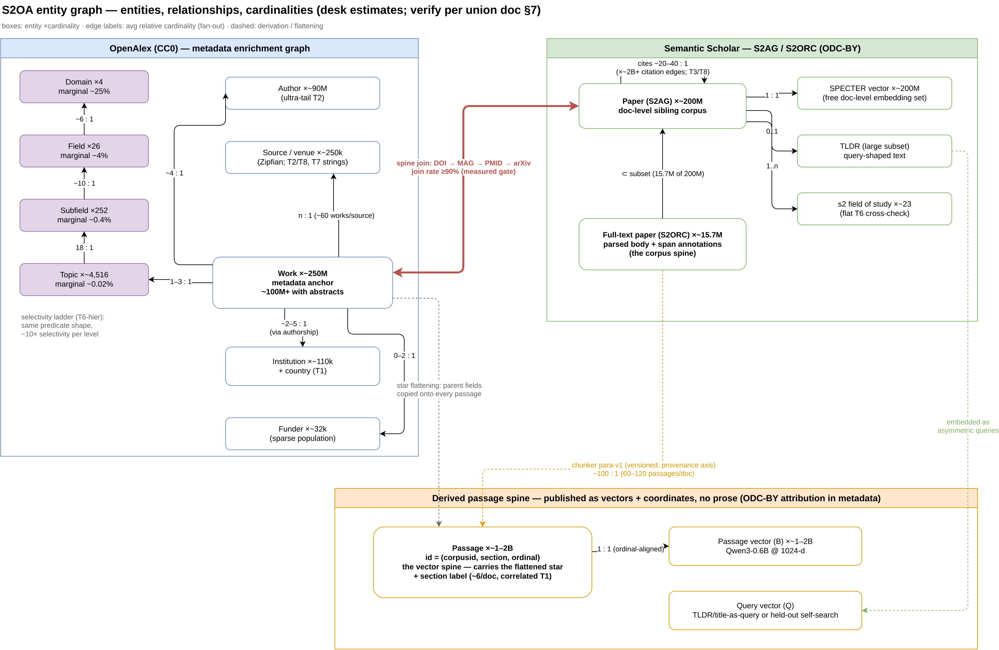
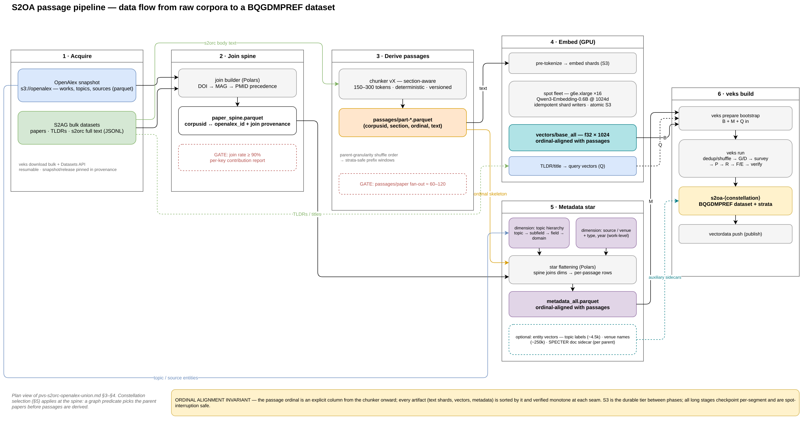

# S2OA: Combined S2ORC × OpenAlex Corpus — Strategy, Selection, and Layout

Status: RECOMMENDATION — cardinalities marked (desk) require snapshot
verification (§7)
Date: 2026-08-15
Companion to: [`pvs-corpus-annex.md`](pvs-corpus-annex.md) (candidates,
criteria, FOC scoring) and
[`amazon-reviews-2023-pvs-plan.md`](amazon-reviews-2023-pvs-plan.md)
(pipeline phases, facet layout, sizing model)

This document specifies the recommended combined corpus from the annex's
cardinality-ceiling analysis (annex §6.4): **S2ORC passages as the vector
spine, OpenAlex as the metadata enrichment graph**, joined by DOI/MAG/PMID.
It defines the strategy, the entity graph (types, cardinalities, relative
cardinalities), the denormalization star that produces the vector+metadata
annex, and the named subset constellations that serve different
predicated-vector-search scenarios.

---

## 1. Strategy

### 1.1 Why a union

Each side supplies what the other lacks:

| | S2ORC/S2AG (ODC-BY) | OpenAlex (CC0) |
|---|---|---|
| **Full text** | ✓ ~15.7M papers, parsed & structured | ✗ (abstracts only, partial) |
| **Passage-level vector spine (1–2B)** | ✓ derivable | ✗ |
| **Precomputed vectors** | ✓ SPECTER, per paper (~200M) | ✗ |
| **Hierarchical topic system** | ✗ (flat ~23 fields) | ✓ 4-level topic hierarchy |
| **Institutions / funders / OA-status graph** | ✗ | ✓ |
| **License** | attribution required | CC0, no strings |

The union yields the annex's two best-scoring texture rows in one corpus
family: passage-level cardinality at the S2ORC ceiling, with OpenAlex's
richest-in-class typed metadata flattened onto every vector.

### 1.2 License posture of the published dataset

- Published facets contain **no prose**: vectors (ours), typed metadata
  (MNode), predicates, ground truth, and passage *coordinates* (parent id,
  section, ordinal) — not passage text. Text lives only in upstream
  preprocessing artifacts.
- S2-derived metadata fields: ODC-BY → publish with attribution.
- OpenAlex-derived fields: CC0 → unrestricted.
- Embeddings of OA full text: derived-work posture consistent with annex §2
  C1 precedent (embeddings published separately from text).

### 1.3 Query strategy (better than perturbed self-search)

The union enables *natural* query semantics unavailable to most corpora:

- **TLDR-as-query**: S2AG ships model-generated TLDRs for a large paper
  subset; a TLDR is a short, query-shaped text whose relevant passages are
  known (its own paper's body) — realistic asymmetric queries with built-in
  relevance priors.
- **Title-as-query**: same shape, universal coverage.
- Held-out perturbed passages (the plan's default self-search) remain
  available as the neutral baseline.

---

## 2. The entity graph

### 2.1 Node types and cardinalities (desk figures — verify per §7)

| Entity | Side | Cardinality | Notes / PVS role |
|---|---|---|---|
| **Passage** | derived | **~1–2B** | the vector spine; carries the flattened star |
| Full-text paper | S2ORC | ~15.7M | passage parent; the corpus spine |
| Paper | S2AG | ~200M | SPECTER vector each; doc-level sibling corpus |
| Work | OpenAlex | ~250M | metadata anchor; ~100M+ with abstracts |
| Author | both | ~90M (OA) | ultra-tail T2 |
| Source / venue | both | ~250k (OA) | long-tail T2, T7 strings |
| Institution | OA | ~110k | T2 + country T1 |
| Topic | OA | ~4.5k | leaf of the hierarchy |
| Subfield / Field / Domain | OA | 252 / 26 / 4 | topic ancestors — the selectivity ladder (§2.3) |
| s2 field of study | S2AG | ~23 | flat T6 cross-check |
| Funder | OA | ~32k | sparse T2 |
| Citation edge | both | ~2B+ | count fields (T3/T8); graph textures |
| SPECTER vector | S2AG | ~200M | free doc-level embedding set |
| TLDR | S2AG | large subset | query source (§1.3) |

### 2.2 Edges and relative cardinalities (fan-outs)

Relative cardinality is what governs predicate selectivity once fields are
flattened onto passages — a parent predicate's passage-level selectivity
equals its paper-level selectivity (each parent contributes ~uniformly many
passages), while absolute match counts multiply by ~100.

| Edge | Fan-out (avg, desk) | Flattened consequence on passages |
|---|---|---|
| Passage → Paper | ~100 : 1 | parent predicates preserve selectivity, ×100 match counts |
| Paper → Author | ~4 : 1 | author EQ ≈ 10⁻⁷ needle (T2 extreme tail) |
| Paper → Source | n : 1 (~60 papers/source avg, Zipfian) | venue EQ spans 10⁻² … 10⁻⁷ (T2/T8) |
| Paper → Topic | 1–3 : 1 | topic EQ ≈ 10⁻³–10⁻⁴ typical |
| Topic → Subfield → Field → Domain | 18:1 / ~10:1 / ~6:1 | **the ladder** (§2.3) |
| Paper → Paper (cites) | ~20–40 : 1 | citation-count quantiles: T3 dial |
| Paper → Institution (via authorship) | ~2–5 : 1 | country T1, institution T2 |
| Paper → Funder | 0–2 : 1 | sparse-population texture |
| Passage → section label | n : 1 (~6 labels) | *correlated* T1 within-paper |

### 2.3 The hierarchy as a built-in selectivity dial

The OpenAlex topic hierarchy gives the same predicate *shape* four
selectivity decades apart — by construction, no calibration needed:

| Level | Values | Mean marginal selectivity |
|---|---|---|
| Domain | 4 | ~25% |
| Field | 26 | ~4% |
| Subfield | 252 | ~0.4% |
| Topic | ~4,516 | ~0.02% |

This is the cleanest instrument available anywhere for the annex's
selectivity-spectrum dimension: sweep `EQ` over one hierarchy path and
selectivity steps ~10× per level while the passing set stays semantically
coherent (high, *measured-to-be-high* T9 lift).

### 2.4 Graph view



*Diagram source: [`s2oa-entity-graph.drawio`](s2oa-entity-graph.drawio). The
PNG embeds the diagram XML — opening it in draw.io recovers the editable
diagram.*

Reading: the **join edge** (Work ⇔ Paper) is the load-bearing element; the
**passage spine** hangs off the S2ORC side; every OpenAlex entity reachable
from Work becomes a flattenable attribute source for passages.

---

## 3. Data selection

### 3.1 The spine

`spine = S2ORC full-text papers ⋈ OpenAlex works` on external ids, in
precedence order **DOI → MAG id → PMID → arXiv id**, keeping join provenance
per row. Expected join rate ≥90% (measure — §7). Unjoined S2ORC papers stay
in the corpus with S2-only metadata and a `oa_joined=false` flag (itself a
useful boolean texture); unjoined OpenAlex works simply don't contribute.

### 3.2 The star (fields flattened onto each passage)

| Group | Fields | Textures |
|---|---|---|
| Passage-local | section label, passage ordinal, char length | correlated T1, T3-minor |
| Parent (S2) | corpusid, year, venue id, citation count, influential-citation count, is-OA, s2 fields of study | T2, T4, T3, T5, T6-flat |
| Parent (OA) | topic + subfield + field + domain ids, OA status, is-retracted, source type, first-author institution id + country, funder id(s), FWCI | T6-hier, T1, T5-rare, T2, T3 |
| Provenance | join source, oa_joined | T5, audit |

### 3.3 Passage policy

- Chunker: deterministic, versioned (provenance axis), section-aware;
  target ~150–300 tokens; passage id = (corpusid, section, ordinal).
- Optional policies per constellation: all passages; first-k per paper
  (cost cap); abstract+intro only (semantic head); claims-style single
  sections.

### 3.4 Pipeline view

The end-to-end data flow — acquisition, join spine, passage derivation,
embedding, metadata star (topic-hierarchy and source/venue dimensions, with
optional entity vectors), and the veks build — with measurement gates and the
ordinal-alignment invariant:



*Diagram source: [`s2oa-passage-pipeline.drawio`](s2oa-passage-pipeline.drawio);
the PNG/SVG renders embed the diagram XML (editable in draw.io).*

---

## 4. Layout

### 4.1 Shared upstream (built once, reused by all constellations)

```
upstream/
  openalex/            # s3://openalex sync (parquet prefix)
  s2ag/  s2orc/        # Datasets API bulk (papers, abstracts, tldrs, embeddings, s2orc)
  join/paper_spine.parquet        # corpusid ↔ openalex_id + doi/mag/pmid + join provenance
  passages/part-*.parquet         # corpusid, section, ordinal, text  (chunker vX)
  stars/<constellation>/metadata_all.parquet   # flattened star, ordinal-aligned
  vectors/<constellation>/base_all.npy         # embedded, ordinal-aligned
```

### 4.2 Per-constellation veks datasets

Each constellation is one veks dataset (`s2oa-<name>`), built via the plan's
Phase 3→4 flow, facets mapping as:

| Facet | Source |
|---|---|
| B | passage embeddings (or SPECTER for the doc-level constellation) |
| Q | TLDR/title queries (embedded) or held-out perturbed self-search |
| M | flattened star → parquet → MNode slab |
| P | survey-calibrated; include hierarchy-ladder predicate sets (§2.3) |
| R/F/E, G/D | per plan |
| O | domain/field partitions (annex layer `correlated` scenarios) |
| strata | **parent-sampled** sized profiles (tooling note, §6) |

---

## 5. Subset constellations

Each constellation = a **selection predicate on the entity graph** → induced
paper set → passage projection (×~100) → star flattening. Cardinalities are
desk estimates.

| Constellation | Graph selection | Vector unit / source | ~N vectors | Primary scenarios |
|---|---|---|---|---|
| `s2oa-pilot-1m` | ~10k parents, sampled ∝ domain mix | passage / local embed | ~1M | end-to-end validation (plan Phase 3) |
| `s2oa-specter-200m` | all joined S2AG papers | **paper / SPECTER (precomputed)** | ~150–200M | doc-level PVS at scale, zero GPU; topic T6; turnkey |
| `s2oa-passages-1b` | full spine | passage / Qwen3-0.6B @1024-d | ~1–2B | cardinality ceiling; selectivity sweeps; all layers |
| `s2oa-ladder` | one subtree per domain (balanced) | passage | ~100M | hierarchy selectivity dial (§2.3) as the featured predicate set |
| `s2oa-domain-part` | partition by domain (4) or field (26) | passage | full spine, partitioned | O-facet oracle partitions; correlated-filter regime |
| `s2oa-temporal` | year buckets (e.g. pre-2000 / decades) | passage | slices | T4 freshness × low-T9 scatter |
| `s2oa-longtail` | tail venues (rank>10³) ∪ tail authors | passage | ~50–100M | T2/T8 needle predicates |
| `s2oa-biomed-mesh` | spine ∩ PubMed (PMID) | passage | ~0.3–0.5B | MeSH T6 grafted; cross-verify vs MedCPT article vectors |

Constellation algebra worth noting: selections compose (`ladder ∩ temporal`),
and every constellation inherits the same star schema — so predicate sets and
testing layers are portable across constellations by construction.

---

## 6. Tooling deltas (beyond the plan's Phase 0)

1. **Parent-sampled strata**: stratify currently windows by row prefix;
   passage corpora need "sample by parent, window by parent-block" so
   strata don't split papers (annex §8). Shuffle at *parent* granularity
   during Phase-1 ordering achieves this with no veks change: order passages
   by shuffled-parent, then prefix windows respect parent blocks.
2. **Set-valued M/P support** (annex §8) — needed for topics/fields lists.
3. **Join builder**: DOI/MAG/PMID resolution with per-row provenance and a
   measured join-rate report (gate: §7).
4. **Chunker versioning**: chunker id + params recorded as a provenance
   axis so passage identity is reproducible.

---

## 7. Measurement gates (before committing the big build)

Per the annex §4.4 protocol, on a ≥1M-parent sample:

- [ ] Join rate S2ORC→OA ≥90% via DOI/MAG/PMID; per-key contribution report.
- [ ] Star field population rates (esp. topics, institutions, funders, FWCI).
- [ ] Hierarchy-ladder marginals within ~2× of §2.3's nominal decades.
- [ ] Passage count/paper distribution (validates the ×100 fan-out and
      total-N estimate).
- [ ] T9 neighborhood-lift spread on pilot embeddings (topics high, year ≈1).
- [ ] Verify desk cardinalities (§2.1) against current snapshot counts.
- [ ] SPECTER coverage rate over the joined spine (for `s2oa-specter-200m`).

Risks: full-text availability skews toward OA-friendly fields (biomed
overrepresented) — measure the domain mix and report it with the dataset
rather than pretending balance; ODC-BY attribution must ride along in
`attributes` metadata; chunker changes invalidate passage identity (hence
§6.4 versioning).

---

## 8. Sources

- [S2ORC corpus](https://github.com/allenai/s2orc);
  [S2AG Datasets API](https://api.semanticscholar.org/api-docs/datasets);
  [S2AG license](https://api.semanticscholar.org/license/)
- [OpenAlex docs](https://help.openalex.org/);
  [snapshot download](https://help.openalex.org/download/download-to-machine);
  [AWS Open Data registry](https://registry.opendata.aws/openalex/)
- Annex §6.4 (cardinality ceiling), §4 (FOC scoring), §8 (tooling);
  plan §4 (phases), §5 (sizing model)
