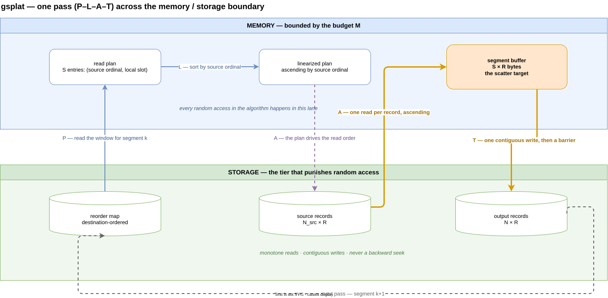
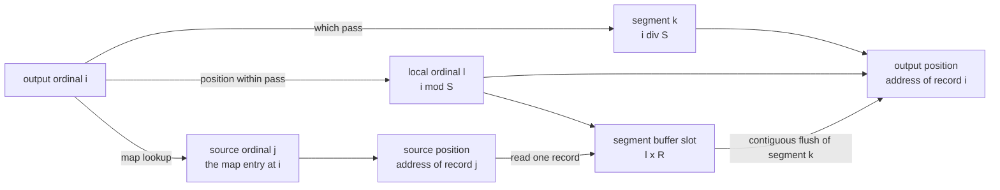

# gsplat — Generalized SPLAT

**S**egment, **P**lan, **L**inearize, **A**ssemble, **T**ransfer: an
external-memory permutation pattern for rewriting a record collection
into a new ordinal order using only sequential access to storage.

gsplat is the runtime-agnostic statement of the algorithm. It names the
capabilities a host runtime must supply, not the ones any particular
system happens to have; a port is a matter of binding six primitives
([host-interface.md](./host-interface.md)) and choosing a memory
budget.

## The problem

You hold a **record store** of `N_src` records addressable by ordinal,
and a **reorder map** that assigns

```
 output[i] = source[map[i]]
```

You want the reordered collection materialized, and the collection is
larger than memory. Applying the map directly costs one random access
per record — `N` random reads if you walk the output in order, or `N`
random writes if you walk the source.

Storage is block-oriented, so that shape is expensive twice over. Each
single-record access moves a whole block in order to use a fraction of
it, which is poor economy for every operation issued; and each one
occupies a slot in the I/O command path, so `N` of them saturate queue
depth and command bandwidth well before the device's throughput is the
limit. Access in order fixes both at once: blocks get used completely,
and the same bytes move in far fewer, far larger operations.

gsplat pays a bounded amount of memory to convert that cost into
monotone reads and contiguous writes.

## Notation

| Symbol | Meaning |
|--------|---------|
| `N` | records to produce (output count) |
| `N_src` | records in the source, `N_src ≥ N` |
| `R` | bytes per record (fixed-stride case); mean bytes per record otherwise |
| `M` | memory budget in bytes |
| `S` | records per segment, `≈ M / R` |
| `P` | pass count, `= max(ceil(N / S), 2)` |
| `W` | container size — the unit the tier or format fetches as a whole |
| `w` | records per container, `= W / R` |

Two units of grouping run through the whole set, and they are
independent of each other:

- a **segment** is what memory holds — a contiguous range of *output*
  ordinals, sized by the budget, one per pass;
- a **container** is what the tier or format fetches and emits as a
  whole — a device block or readahead window on a flat store, a row
  group, stripe, chunk, or page on a structured one.

Segments are chosen by you; containers are given to you. Neither
constrains the other.

## Contract and preconditions

1. **Destination-ordered map.** The map is a sequence indexed by
   *output* ordinal whose values are *source* ordinals. Position is the
   destination; the value is the origin. A source-ordered map produces
   the inverse rewrite, silently — see
   [02-plan.md](./02-plan.md#orientation-is-a-contract-not-a-check).
2. **Invariant, low-order access by ordinal.** Given an ordinal, the
   host can produce that record at a cost that is essentially the same
   for every ordinal, and that stays low-order when reads are issued in
   order. Structural deserialization and decompression along the way are
   expected, and memoizing them is normal practice. Linearize exists so
   that this access is always issued in order.
3. **Strictly monotonic ordinal structure.** Within an ordinal space,
   ordinals ascend strictly with physical address:
   `i < j ⟹ address(i) < address(j)`. A flat store gets this from
   `address = base + i × R`; a structured store gets it from [DFS normal
   form](./structured.md#dfs-normal-form). This is a **premise of the
   whole family**, not a per-variant assumption — it is what lets
   Linearize sort by ordinal and call the result an I/O order, and every
   variant of the problem inherits it. Where several spaces coexist, it
   holds *per space*.
4. **Positional or strictly-ordered sink.** The host can either write a
   byte range at a computed offset, or accept appends in output order.
5. **A memory budget large enough to make the pass count affordable.**
   There is no meaningful absolute floor. Correctness needs one record's
   worth; usefulness needs far more, because the budget *is* the pass
   count:

   ```
    P = ceil(N × R / M)     and total work is linear in P
                            up to the container-size crossover
   ```

   A budget of a few records is perfectly legal and completely useless:
   with `P` that large the segments hold too little to amortize
   anything, reads fall back to one block per record, and gsplat
   degenerates into exactly the naive permutation it exists to avoid.
   The real precondition is a ratio, not a constant: **`M` must be a
   large enough fraction of `N × R` that the resulting `P` costs
   something you would accept.** Size the budget by the pass count you
   can afford; see [01-segment.md](./01-segment.md) and
   [cost-model.md](./cost-model.md).

The map need not be *stored*: a computable permutation (a seeded
shuffle, a modular stride, a rank function) satisfies the contract just
as well, and makes the plan step cheaper still.

Precondition 3 says *strictly* monotonic, which makes the map an
injection: one source record lands at one output position. Relaxing it
to non-strict would admit ties — the same source record contributed to
several output positions — turning the map from a permutation into a
general function. That is a coherent extension and a different problem:
the single-read invariant survives (drain a record's slots while it is
resident) but uniqueness validation, compaction, and the plan's
one-slot-per-entry structure all change. Out of scope as written.

## The pattern

```
             reorder map:  output[i] = source[map[i]]

 S  segment   ┌─ OUTPUT ordinal space ──────────────────────────┐
              │  segment 0   │  segment 1   │  segment 2        │
              └──────────────┴──────────────┴───────────────────┘
              size = memory budget / record size   (≥ 2 segments)

              ── for each segment k (one "pass") ──

 P  plan      take the map window covering segment k, reversing
              each entry:  [(src 902117, out 2), (src 3, out 0),
                            (src 71442, out 1)]

 L  linearize sort the plan by source ordinal
              → [(src 3, out 0), (src 71442, out 1), (src 902117, out 2)]

 A  assemble  read source ascending, scatter into the segment buffer
                  src 3      ──► buf[out 0]
                  src 71442  ──► buf[out 1]   random writes stay in RAM
                  src 902117 ──► buf[out 2]

 T  transfer  write the buffer contiguously at segment k's position
              ──────────────────────────────────────► next pass
```

Segmenting happens once; **P–L–A–T** repeat per pass.

### Data flow

One pass, with the memory / storage boundary drawn as the thing it
actually is — the line every arrow has to cross, and the reason the
algorithm is shaped the way it is.



*Source: [`gsplat-dataflow.drawio`](./gsplat-dataflow.drawio); the SVG
embeds the diagram, so opening it in draw.io recovers the editable
original.*

Read it by lanes rather than by boxes. Everything scattered — building
the plan, sorting it, transposing records into the buffer — happens in
the **memory** lane. The **storage** lane sees only a window read, an
ascending sweep, and one contiguous write. The whole algorithm exists to
keep both of those statements true at the same time.

### Ordinal remapping

Three coordinate systems meet in the assemble step. One output ordinal
`i` fixes all of them: which pass owns it, where its bytes come from,
and where they land.



In symbols:

```
 output[i]   = source[map[i]]               the map's contract
 k           = i div S                      pass that owns i
 l           = i mod S                      segment-local ordinal
 read from   = address_of(map[i])           source address
 scatter to  = l × R                        buffer offset
 write to    = address_of(i)                output address
```

For fixed-stride records `address_of(n) = base + n × R`. For
variable-length records it is an index lookup on the read side and
strict append order on the write side ([04](./04-assemble.md),
[05](./05-transfer.md)).

## Invariants

- **Single read, single write.** Every mapped source record is read
  exactly once across all passes; every output byte is written exactly
  once.
- **Monotonic access.** Within a pass, source reads ascend by address
  and the output write is one contiguous range.
- **Bounded memory.** Resident state is one segment buffer plus the
  active pass's plan — never a function of `N`.
- **Determinism.** Output depends only on the source and the map. Pass
  count, worker count, and scheduling never change the bytes produced.

The invariants describe what the *algorithm* issues. What the storage
tier actually fetches is a separate question, answered by the read
amplification model in [cost-model.md](./cost-model.md).

## When it fits

Use gsplat when all of these hold:

- the collection exceeds the memory budget,
- random access on the storage tier is materially worse than
  sequential — in latency, in throughput, or in per-request price,
- the map is known before the rewrite starts (it is materialized or
  computable, not discovered as you go).

Skip it when:

- **The collection fits in memory.** Read it, permute in place, write
  it. gsplat's floor of two segments already degenerates toward this.
- **Records are much smaller than a container.**
  When `R << W`, a random read costs the same as a sequential one — the
  container dominates either way — and direct indexed lookup through
  the host's cache beats pass orchestration.
- **The map is the identity or already ascending.** A selection list in
  source order is a streaming filter, not a permutation: read and write
  both sequentially in one pass, skipping **L** and **A** entirely.
- **The storage tier has no meaningful ordering** — a true random-access
  medium with uniform cost. There is nothing to buy.

## Documents

| | Step | Guide |
|---|------|-------|
| **S** | Segment | [01-segment.md](./01-segment.md) — size the passes from the memory budget |
| **P** | Plan | [02-plan.md](./02-plan.md) — select and reverse the map window for one output segment |
| **L** | Linearize | [03-linearize.md](./03-linearize.md) — sort the plan into source order |
| **A** | Assemble | [04-assemble.md](./04-assemble.md) — sequential gather, in-memory scatter |
| **T** | Transfer | [05-transfer.md](./05-transfer.md) — contiguous flush, durability, next pass |

- [host-interface.md](./host-interface.md) — the six primitives a
  runtime must supply, with bindings for POSIX, JVM, object storage,
  and in-memory hosts.
- [cost-model.md](./cost-model.md) — order-of-growth against the naive
  permutation, the read amplification factor, worked examples, and the
  two-level extension.
- [structured.md](./structured.md) — **sgsplat**: hierarchical sources
  and sinks, where a traversal fixes the ordinal space and a skeleton
  carries the map. Covers address-vs-ordinal ordering, container-atomic
  containers, ordered-append output, and per-leaf-path decomposition.
- [annex-multiple-spaces.md](./annex-multiple-spaces.md) — annex:
  several types in distinct ordinal spaces with independent maps,
  interleaved into the output by a known schedule. Not depended on by
  anything above.
- [annex-ordering-forest.md](./annex-ordering-forest.md) — annex: the
  same model worked concretely on one small schema, from annotation
  through to the plan the algorithm executes.

## Origin

gsplat is generalized from a working implementation in a vector-dataset
toolchain, where it applies shuffle, dedup, and stratification maps to
multi-terabyte vector collections. That instantiation — with its
concrete file formats, resource negotiation, and per-format variants — is
documented separately as SPLAT; this document deliberately keeps none
of it.
