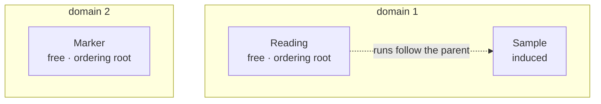
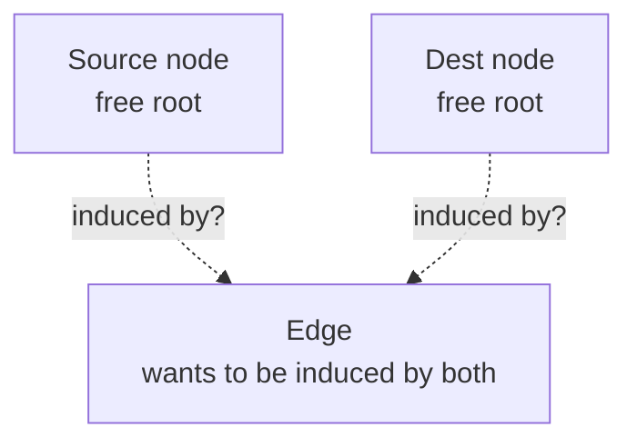

# Annex — The ordering forest, concretely

Status: **active annex**, companion to
[annex-multiple-spaces.md](./annex-multiple-spaces.md), which states the
model in the abstract. This one works a single small example all the way
through: a schema, an instance, the maps, the schedule, the output, and
the plan the algorithm actually executes. Every number below is
traceable.

## The schema, annotated

Three types. The only question asked of each is **who decides its
order**, and there are two possible answers: it carries its own map (it
is a **free** type, an **ordering root**), or its order is fixed by its
parent's (it is **induced**).



Domain 1 is governed by one map, at `Reading`; domain 2 by one map, at
`Marker`. Two free types, so **two ordering roots, and therefore two
domains**.
`Sample` has no map of its own; its order is derived. No edge crosses a
domain boundary — that is what makes the annotation a forest rather than
a general graph.

## The instance

Eleven source records. The spaces are **interleaved in the source**, as
they always are, so the global ordinal space **M** — numbered in
physical address order — runs straight through all three types:

| M-ordinal | record | type | ordinal in its own space |
|-----------|--------|------|--------------------------|
| 0 | R0 | Reading | 0 |
| 1 | S0.0 | Sample | 0 |
| 2 | S0.1 | Sample | 1 |
| 3 | M0 | Marker | 0 |
| 4 | R1 | Reading | 1 |
| 5 | S1.0 | Sample | 2 |
| 6 | S1.1 | Sample | 3 |
| 7 | S1.2 | Sample | 4 |
| 8 | M1 | Marker | 1 |
| 9 | R2 | Reading | 2 |
| 10 | S2.0 | Sample | 5 |

Each space is strictly monotonic in address — Reading runs 0,1,2 at
M-ordinals 0,4,9; Marker runs 0,1 at 3,8 — which is the family premise
holding per space. Nothing about the *global* numbering identifies a
record's type, which is why tags have to be carried explicitly.

The induced structure is a run index: which Samples belong to which
Reading.

```
 Reading 0 → samples [0, 2)      S0.0 S0.1
 Reading 1 → samples [2, 5)      S1.0 S1.1 S1.2
 Reading 2 → samples [5, 6)      S2.0
```

## The maps

One map per ordering root. Two roots, two maps — not three, and not one
per type:

```
 map_Reading = [2, 0, 1]     output Reading position 0 takes source Reading 2
 map_Marker  = [1, 0]        output Marker  position 0 takes source Marker 1
```

`Sample` gets no map. Its order is **derived** by carrying each
Reading's run along with it:

```
 source order                     output order, per map_Reading = [2, 0, 1]
 ─────────────────────────        ──────────────────────────────────────────
 Reading 0 · samples 0,1          position 0 ← Reading 2 · drags sample 5
 Reading 1 · samples 2,3,4        position 1 ← Reading 0 · drags samples 0,1
 Reading 2 · sample 5             position 2 ← Reading 1 · drags samples 2,3,4
```

Each Reading takes its whole run of Samples with it; the run never
splits and never reorders internally. Reading the runs off in output
order gives the derived Sample map:

```
 map_Sample = [5, 0, 1, 2, 3, 4]      derived, never supplied
```

That is the whole of run expansion. A caller who had to state
`map_Sample` by hand could get it wrong; a caller who states
`map_Reading` cannot.

## The schedule, and why it has to exist

`map_Reading` fixes the order of the Reading blocks. `map_Marker` fixes
the order of the Markers. **Neither says how the two interleave**, and
nothing else does either.

Concretely: three Reading blocks and two Markers, with each domain's
internal order already fixed, can be interleaved in

```
 C(5, 2) = 10 distinct ways
```

Ten legal outputs, all consistent with both maps. Something has to pick
one, and that something is the **schedule**. Pick this one:

```
 slot:    0        1        2        3        4        5        6        7        8        9       10
 domain:  Reading  Sample   Marker   Reading  Sample   Sample   Reading  Sample   Sample   Sample   Marker
```

## The output, traced

Now every slot resolves. Each domain's records are consumed in its own
output order; the schedule only decides *where*:

| slot | type | position in its space | source record | M-ordinal |
|------|------|----------------------|---------------|-----------|
| 0 | Reading | 0 | R2 | 9 |
| 1 | Sample | 0 | S2.0 | 10 |
| 2 | Marker | 0 | M1 | 8 |
| 3 | Reading | 1 | R0 | 0 |
| 4 | Sample | 1 | S0.0 | 1 |
| 5 | Sample | 2 | S0.1 | 2 |
| 6 | Reading | 2 | R1 | 4 |
| 7 | Sample | 3 | S1.0 | 5 |
| 8 | Sample | 4 | S1.1 | 6 |
| 9 | Sample | 5 | S1.2 | 7 |
| 10 | Marker | 1 | M0 | 3 |

Read the last column off and you have the global map:

```
 gmap = [9, 10, 8, 0, 1, 2, 4, 5, 6, 7, 3]
```

One map, one space, a permutation of eleven elements — the base problem.
Three maps and a schedule went in; one permutation came out.

## What the algorithm actually runs

Sort that plan by source M-ordinal and the reads become one ascending
sweep, with the scatter pushed entirely into the destination column:

```
 read M-ordinal:   0    1    2    3    4    5    6    7    8    9   10
 write slot:       3    4    5   10    6    7    8    9    2    0    1
                   └──── ascending source, scattered destinations ────┘
```

That is the whole of Linearize and Assemble for this instance: walk the
source once, forwards, contributing each record to the builder at the
slot named above. Nothing in the multi-domain structure survives into
the inner loop — it was all consumed in building the plan.

## Counting the freedom

The model says the choices available are one permutation per root, times
the schedule. On this instance:

| Source of freedom | Choices |
|-------------------|---------|
| `map_Reading` (free) | 3! = 6 |
| `map_Marker` (free) | 2! = 2 |
| `map_Sample` (induced) | **1** — none |
| schedule | 10 |
| **total expressible rewrites** | **120** |

The induced type contributes a factor of exactly one. Promoting
`Sample` to a free root would multiply the space of rewrites by 6! =
720 — and would simultaneously destroy the only property that made the
schema meaningful, since samples could then land anywhere, detached from
their Reading. **Induced is not a limitation being tolerated; it is the
guarantee being bought.**

## Why the schedule appears only with multiple roots

Delete the Markers and the schedule has nothing left to decide:

```
 one root                              two roots
 ────────────────────────────          ────────────────────────────
 map_Reading = [2, 0, 1]               map_Reading = [2, 0, 1]
                                       map_Marker  = [1, 0]

 output is fully determined:           output is NOT determined:
   R2 S2.0 R0 S0.0 S0.1 R1 …             10 legal interleavings
                                         ↑ the schedule picks one
 nothing left to specify               a schedule must be supplied
```

With a single root, the root map fixes root order, each record's induced
children follow it, and the schema fixes the nesting — the leaf sequence
falls out with no further input. The schedule is **exactly the freedom
that a second root introduces**, which is why it appears in this annex
pair and nowhere else in the set, and why single-root systems have never
needed to name it.

## The shape that cannot be expressed

The annotation is well-formed only if each type has **at most one**
ordering parent. A type that wants to be clustered by two parents at
once has two candidates and no valid annotation:



Two induced edges into one type is a diamond, not a forest, and there is
no single map from which `Edge`'s order can be derived. Two escapes,
both ordinary:

- **Duplicate the type**, once per clustering — one domain per copy.
  This is what relational systems do when they want a table clustered
  two ways, and the cost is the extra copy.
- **Pick one parent.** `Edge` becomes induced by `Source node`, and its
  relationship to `Dest node` takes whatever order falls out.

## Related

- [annex-multiple-spaces.md](./annex-multiple-spaces.md) — the model in
  the abstract: spaces, the schedule, the global-space lens, and the
  cost consequences.
- [structured.md](./structured.md) — sgsplat, including the run
  expansion this annex uses for induced types.
