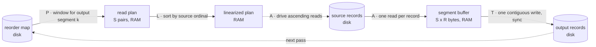
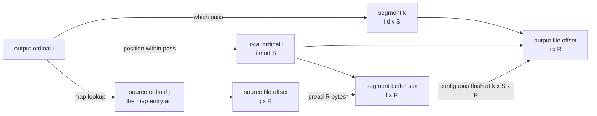

# SPLAT — Segment, Plan, Linearize, Assemble, Transfer

SPLAT is the I/O-sympathetic ordinal rewrite used by index-based
`transform extract`. Given a reorder map — an ivec in **destination
order**, where entry `i` names the source record that belongs at
output position `i` — SPLAT materializes the permuted output using
only sequential disk I/O.
All random access — the scatter inherent in any permutation — is
absorbed by an in-memory segment buffer.

The name maps one letter to each step, and doubles as a wink at the
assemble step, which is a scatter-write ("splatting" in the graphics
sense). Segmenting happens once; plan–linearize–assemble–transfer
repeat per pass.

Canonical specification:
[09-algorithms.md §9.4](../09-algorithms.md#94-splat-io-sympathetic-ordinal-rewrite).
Runtime-agnostic statement of the same algorithm, with the host
primitives it needs and no dependence on this system's formats or
resource plumbing: [gsplat](../../gsplat/README.md).

## When it runs

Any index-mode extraction where the source outweighs RAM:

- Applying a `generate ivec-shuffle` permutation to split a corpus
  into disjoint query/base sets (fvec, mvec)
- Extracting deduplicated subsets via sorted dedup ordinals (fvec)
- Reordering metadata slabs so `base_metadata.slab[i]` stays aligned
  with `base_vectors.{f,m}vec[i]` (slab)

`ivec-extract` is the deliberate exception: integer records are so
small that direct indexed lookup through the page cache beats pass
orchestration.

## The whole pattern at a glance

```
             reorder map (ivec):  out[i] = src[map[i]]

 S  segment   ┌─ output ordinal space ──────────────────────────┐
              │  segment 0   │  segment 1   │  segment 2        │
              └──────────────┴──────────────┴───────────────────┘
              size = memory budget / record size   (≥ 2 segments)

              ── for each segment k (one "pass") ──

 P  plan      scan the map window for segment k
              → [(src 902117, out 2), (src 3, out 0), (src 71442, out 1)]

 L  linearize sort the plan by source position
              → [(src 3, out 0), (src 71442, out 1), (src 902117, out 2)]

 A  assemble  read source ascending, scatter into the segment buffer
                  src 3      ──► buf[out 0]
                  src 71442  ──► buf[out 1]     random writes stay in RAM
                  src 902117 ──► buf[out 2]

 T  transfer  write the buffer contiguously at segment k's offset
              ──────────────────────────────────────► next pass
```

What the disk sees, naive versus SPLAT:

```
 naive permute      read:   ╲__╱▔╲___╱╲_   N seeks chasing the map
                    write:  ▔╲_╱▔▔╲_╱╲__   N seeks (or vice versa)

 SPLAT              read:   ────────►  ────────►  ────────►
                    write:       ───►       ───►       ───►
                            ascending per pass; one contiguous
                            burst per pass; P passes total
```

## Data flow

One pass, with the disk/RAM boundary drawn explicitly. Solid edges
carry bytes; the dotted edge is the linearized plan *driving* the reads
rather than data moving.



Cylinders are on disk, rectangles in RAM.

Everything random lives inside the RAM box. The two disk boxes see
only monotone reads and contiguous writes.

## Ordinal remapping

Three coordinate systems meet in the assemble step. A single output
ordinal `i` fixes all of them: which pass touches it, where its bytes
come from, and where they land.



In symbols, with `S` records per segment:

```
 out[i]      = src[map[i]]                  the map's contract
 k           = i div S                      pass that owns i
 l           = i mod S                      segment-local ordinal
 read from   = map[i] × R                   source byte offset
 scatter to  = l × R                        buffer byte offset
 write to    = (k × S + l) × R = i × R      output byte offset
```

The plan entries are `(map[i], l)` pairs: linearize sorts on the first
element to make the reads ascend, and assemble uses the second as the
RAM-side scatter target. `range_start` shifts the map window when an
extraction covers only part of the map — the `[0,K)` / `[K,N)` query
and base halves of a shuffle split are two such extractions.

## Invariants

- **Single read, single write.** Every mapped source record is read
  exactly once across all passes; every output byte is written
  exactly once.
- **Monotonic access.** Within a pass, source reads ascend by file
  offset and the output write is one contiguous range.
- **Bounded memory.** Resident state is one segment buffer (at most
  the governor budget, and at most half the output) plus the read
  plan for the active segment.
- **Determinism.** Output depends only on the source and the reorder
  map — pass count and thread count never change the bytes produced.

One precondition sits underneath all of them: the map must be
**destination-ordered**, and segments partition the **output** ordinal
space accordingly. That ordering is a format contract rather than a
verified property — a source-ordered map runs clean and produces the
inverse rewrite
([02-plan.md](./02-plan.md#if-the-map-is-source-ordered)).

## Step guides

| Step | Guide | One-liner |
|------|-------|-----------|
| **S** | [01-segment.md](./01-segment.md) | Size the passes from the memory budget; segments partition the **output** |
| **P** | [02-plan.md](./02-plan.md) | Reverse the destination-ordered map window into `(source, output)` pairs for this segment |
| **L** | [03-linearize.md](./03-linearize.md) | Sort the plan into ascending source order |
| **A** | [04-assemble.md](./04-assemble.md) | Sequential gather, in-RAM scatter |
| **T** | [05-transfer.md](./05-transfer.md) | Contiguous flush, sync, next pass |

Cost analysis — order-of-growth against the naive permutation, the read
amplification factor, and worked examples at project scale:
[cost-model.md](./cost-model.md).

## Implementations

All in `veks-pipeline/src/pipeline/commands/gen_extract.rs`, dispatched
by `transform extract` on the source file type:

| Function | Records | Twist |
|----------|---------|-------|
| `sorted_index_extract_mvec` | f16, fixed stride | Reference shape of the pattern |
| `sorted_index_extract_fvec` | f32, fixed stride | pread-based reads, sorted-plan fast path, near-zero skip with compaction |
| `sorted_index_extract_slab` | variable length | Sampled record-size estimate, output-order re-sort, per-segment resume cache |

Per-variant details live in the step guides where they diverge.
