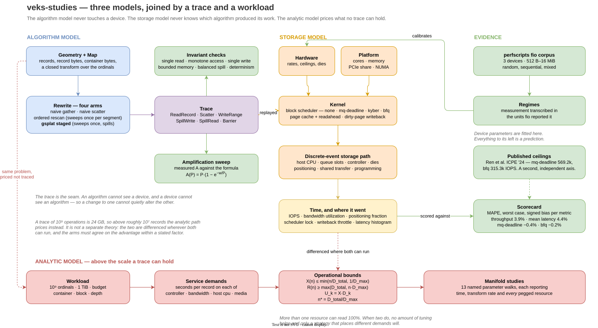
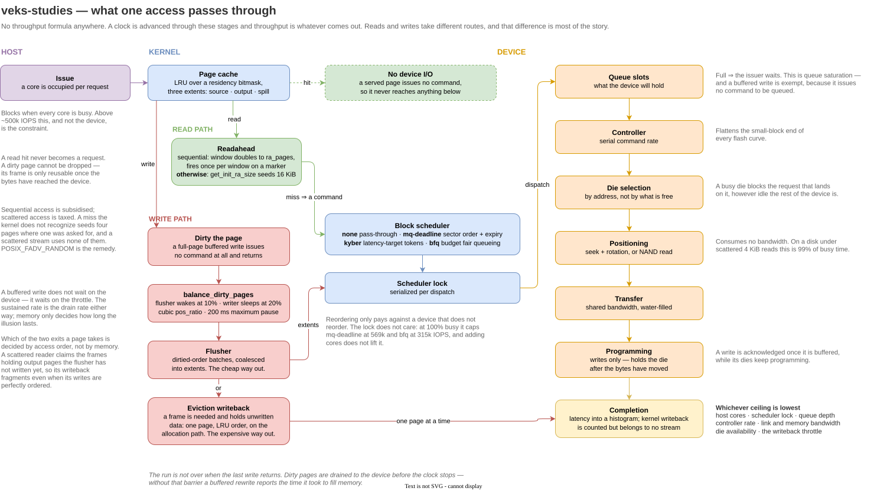
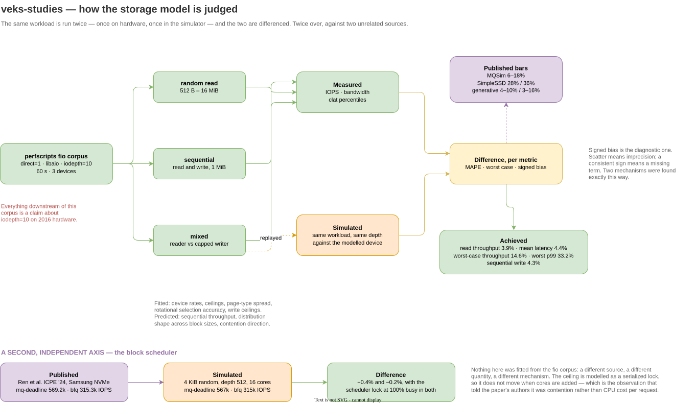

# veks-studies

Executable models of the SPLAT family of I/O-ordered rewrites, and a
storage simulator accurate enough to price them.

This document exists so you can decide how much to believe the numbers
this crate produces. It states what is measured, what is fitted, what is
predicted, what is asserted without evidence, and where the model is
known to be wrong.

---

## What this is

Three layers, and the distinctions matter.



**A model of the algorithm.** `algo`, `model`, `check` and `study`
simulate the rewrite itself — every read, scatter, spill and write
recorded as a virtual operation in a trace. Nothing here touches a
device. It exists so that claims in `docs/gsplat/` can fail a test: that
every mapped record is read exactly once, that reads ascend within a
pass, that everything spilled is read back exactly once, that resident
memory stays inside its budget, that container touches follow
`A(P) = P · (1 − exp(−w / P))`.

**A model of the storage path.** `io`, `cache`, `device` and `regime`
turn a trace into a time. This is a discrete-event simulator: it advances
a clock through positioning, transfer and programming against a shared
bandwidth ceiling, a finite command queue, a serial controller, dies with
address affinity, a page cache with kernel-style readahead and dirty-page
writeback, and a block scheduler that costs what the measured ones cost.
**It contains no throughput formula.** Throughput is what falls out.

**A model of the cost at scale.** `scale`, `queueing` and `manifold`
price a workload no trace can hold. A billion-operation trace is 24 GB,
so above roughly 10⁷ records the strategies are priced as service demands
per record and bounded by operational analysis instead. This is not a
separate theory: the two are differenced wherever both can run.

`validate` scores the second layer against measurement — twice, against
two unrelated sources.

Every stage one access passes through, and what can stop it at each.
Reads and writes take different routes, and that difference is most of
the story:



## Running it

```
veks-study sweep <axis> [options]   # vary one parameter, see the deltas
veks-study study <name>             # a terabyte-scale parameter walk; `all` for every one
veks-study validate                 # the scorecard below
veks-study devices                  # what is modelled
veks-study report                   # the full standing report
veks-study help                     # axes, studies and options
```

Sweeps vary exactly one parameter, hold the rest fixed, print what they
held, and put a delta column beside every metric — because the shape of a
dependence is almost always the thing being argued about, not any single
value.

```
$ veks-study sweep depth --device nvme-modern --cores 8

  sweep: depth
  held:  device=nvme-modern  block=4096  cores=8

  depth           IOPS       d        MB/s       d        util       d        posn       d
  1               8.4k       —          34       —          0%       —         91%       —
  8              77.6k +826.4%         318 +826.4%          5% +826.4%         43%  -53.0%
  32            325.8k    +39x        1335    +39x         19%    +39x          5%  -94.9%
  128           895.0k   +107x        3666   +107x         52%   +107x          6%  -93.2%
```

Axes: `block`, `depth`, `device`, `cores`, `page`, `ram`, `readahead`,
`numa`, `fabric`, `record`, `budget`. `--vs first|prev|none` chooses what
the deltas are measured against.

### Studies — where a staged rewrite becomes necessary

**[docs/findings.md](docs/findings.md) is the explainer**: every table
these produce, what each one is evidence for, and the test that keeps it
honest. Read that if you want the results; run the commands below if you
want to reproduce them.

Sweeps run at tens of thousands of records, which finishes in seconds by
any method and never presses against a ceiling. The **studies** ask the
question that scale cannot: at a terabyte and a billion ordinals, with
memory a small fraction of the payload, which strategies finish and
which do not.

```
veks-study study scale        # ordinal count, a million to a billion
veks-study study memory       # memory as a fraction of the payload
veks-study study record       # record size — where the boundary actually is
veks-study study strategies   # all four strategies, per device
veks-study study pegged       # which resources saturate, and how many at once
veks-study study bounds       # D_max, the knee n*, utilization
veks-study study depth        # issue depth against the knee
veks-study study fanout       # container size, fan-out, stage count
veks-study study readahead    # why block readahead taxes a scattered rewrite
veks-study study scheduler    # what the Linux block scheduler costs
veks-study study writeback    # dirty-page pacing and the eviction path
veks-study study frontier     # the boundary itself
```

Four strategies are priced, not two:

| Strategy | Reads | Writes | Cost |
|---|---|---|---|
| naive gather | random, one command per record | coalesced | `N` commands, `⌈R/B⌉·B` bytes each |
| naive scatter | streamed | random; a partial block costs a read-modify-write | `N` commands, bytes twice |
| ordered rescan | ascending, but the source is swept once per segment | coalesced | `A(P)` read passes, `A(P) = P·(1−e^{−w/P})` |
| **gsplat staged** | ascending, **once** | coalesced, via a spill extent | `ceil(log_f(segments)) + 1` sequential passes each way |

The distinction between the last two is the finding the studies keep
returning to. Ordering the reads is not what scales — **staging** is.
A re-scan's cost grows with `payload/M`; a staged rewrite's grows with
`log_f(payload/M)` where `f = M/W` is the fan-out, a quarter of a million
for a 32 GiB budget and 128 KiB containers. A terabyte and a petabyte
both need exactly one distribution stage.

## Reproducing everything here

```
cargo test -p veks-studies                 # 115 assertions
cargo run -p veks-studies --bin veks-study # every table below
```

Diagnostic dumps are `#[ignore]`d tests; run one with, for example:

```
cargo test -p veks-studies --release print_validation_report -- --ignored --nocapture
```

## What it is validated against

Every device figure comes from the
[perfscripts](https://github.com/jshook/perfscripts) fio corpus:

| | |
|---|---|
| Devices | Toshiba HDWD110 (7200 RPM SATA), Samsung 850 Pro (SATA SSD), Samsung 950 Pro (NVMe) |
| Run conditions | `direct=1, ioengine=libaio, iodepth=10, size=5G, time_based, runtime=1m` |
| Workloads | random read 512 B–16 MiB, sequential read, sequential write, and a mixed random-reader / rate-capped sequential reader+writer sweep |
| Metrics used | IOPS, bandwidth, and full `clat` percentile distributions |

**Everything derived from this corpus is a statement about `iodepth=10`
on 2016 hardware.** That is the single most important caveat in this
document. Conclusions about whether ordering pays are strongly
concurrency-dependent, and the corpus fixes concurrency at one value.

## Accuracy



Scored across three devices and every block size from 512 B to 1 MiB, as
mean absolute percentage error against measurement. Latency is compared
on fio's `lat` basis — submission to completion — because that is what
the simulator times.

| Device | Metric | MAPE | Worst | Bias |
|---|---|---|---|---|
| spinning-sata | throughput | 2.6% | 7.5% | +2.6% |
| | mean latency | 2.0% | 6.1% | −2.0% |
| | p50 / p95 / p99 | 6.4% / 5.3% / 7.4% | | |
| sata-ssd | throughput | 1.5% | 3.5% | +0.7% |
| | mean latency | 1.9% | 3.8% | −0.7% |
| | p50 / p95 / p99 | 3.3% / 10.4% / 12.0% | | |
| nvme-consumer | throughput | 7.0% | 14.6% | −3.7% |
| | mean latency | 8.4% | 17.1% | +8.0% |
| | p50 / p95 / p99 | 10.0% / 10.5% / 13.4% | | |
| **aggregate** | **throughput** | **3.7%** | 14.6% | −0.1% |
| | **mean latency** | **4.1%** | 17.1% | +1.7% |
| | p50 / p95 / p99 | 6.6% / 8.7% / 11.0% | 30.3% | |
| **sequential write** | **throughput** | **0.2%** | 0.5% | +0.2% |
| | **latency** | **0.7%** | 1.3% | −0.7% |

Against the bars the literature states, compared like for like — mean
error against mean error, worst case against worst case:

| | Reported | Here |
|---|---|---|
| [MQSim](https://www.usenix.org/conference/fast18/presentation/tavakkol) (FAST '18), throughput vs 4 real SSDs | 6–18% | 3.7% MAPE / 14.6% worst |
| [SimpleSSD](https://arxiv.org/pdf/1705.06419), worst-case throughput | 28% | 14.6% |
| SimpleSSD, worst-case latency | 36% | 30.3% (p99) |
| [Generative black-box models](https://arxiv.org/pdf/2307.02073) | 4–10% IOPS, 3–16% latency | 3.7% / 4.1% |

## Fitted, predicted, or asserted

The word "validated" does a lot of work in simulator papers. Here is the
breakdown for this one.

**Fitted — agreement proves the fit converged, not that the model is
right:**

- Device parameters (`media_rate`, `bus_rate`, `access_latency`,
  `max_command_rate`, die counts and stripe) were tuned against the
  random-read throughput curve.
- The disk's `rotational_awareness` and `command_expiry_s` were tuned
  against measured latency percentiles and the contention sweep.
- The read-retry *rate* in `ReadVariation`. The retry mechanism and the
  page-type latencies around it are published; how often a particular
  drive retries at a particular wear level is not.
- The disk's `command_expiry_s` was fitted against the contention sweep.
- Write-path ceilings were fitted against measured sequential write.

**Sourced — read off published characterisation, not tuned:**

- NAND page-type read latencies and program-latency bands, from the SSD
  survey below. Swapping the previously-fitted spread for the published
  band cost about two points of p50 agreement and gained on p95 — a fair
  price for parameters that no longer answer to the score.
- Die counts, from controller teardowns. Correcting the NVMe drive from
  an invented 128 to its controller's actual 64 left reads untouched and
  put sequential write 12% low, because eight concurrent 1 MiB writes now
  exhaust the parallelism before the write ceiling is reached. That
  residual is left standing.
- Host per-request cost, as named API presets from SYSTOR '22.

**Predicted — not tuned against, so agreement is evidence:**

- Sequential read throughput. Exact on all three devices (201/201,
  568/568, 1500/1497 MB/s).
- The *shape* of the latency distribution across block sizes, once the
  variation parameters are set at one point. `ReadVariation` is
  mean-preserving by construction, so it cannot have flattered any mean.
- The contention sweep's direction and rough magnitude.
- `command_expiry_s` was fitted to contention and then found to match the
  drive's measured maximum completion latency (607.7 ms) — two
  independent routes to one number.

**Asserted — no evidence either way:**

- Random-write behaviour, garbage collection, write amplification. The
  corpus has no random-write job. These are modelled and move in the
  right direction; nothing more is claimed.
- The modern NVMe regime, calibrated to published figures from
  [Ren et al. (ICPE '24)](https://dl.acm.org/doi/10.1145/3629526.3645053)
  and [MQSSD](https://arxiv.org/abs/2507.06349) rather than to a sweep
  run here.
- NUMA and multi-device fabric sharing. Structurally reasonable,
  unmeasured. Every source measurement was single-socket with a
  dedicated link.

## Known divergences

Stated because a model that hides these is not worth using.

- **Contention on flash is understated.** Reproducing the `mixed` job,
  the simulated random reader lands 20–33% below measurement at capped
  points, and the uncapped collapse comes out several times gentler than
  the measured 178×. Die-level blocking brought this from 85× wrong to
  roughly 3× wrong; the residual is real.
- **NVMe carries a +10% median bias.** That drive's measured bandwidth
  peaks at 128 KiB and *falls* for larger blocks, exceeding its own
  single-stream sequential rate. No monotone ceiling reproduces both
  ends, and raising the ceiling to fix latency costs throughput.
- **The disk's tail ratio runs 13% light** and the NVMe's 19% light.
- **`transfer_share_spread` is not strongly determined.** Raising it
  trades scatter for bias monotonically, with no optimum. The value is a
  judgement.

## What the kernel does to the rewrite

Three parts of the operating system move the answer by more than the
algorithm often does, so all three are modelled rather than assumed away.

**Block scheduler.** `none`, `mq-deadline`, `kyber` and `bfq`, each with
its real policy and its measured cost. Ren et al. (ICPE '24) find the
cost is lock contention rather than policy, so it is modelled as a
serialized per-dispatch time: against a 785.7 KIOPS device, `mq-deadline`
reproduces at 567k against its published 569.2k and `bfq` at 315k against
315.3k. `kyber`'s token rule is the paper's — a direction's depth is cut
only when it is well served *and the other direction is starved* — not a
latency clamp, which would be a much harsher algorithm.

**Writeback pacing.** Dirty pages, the two thresholds
(`dirty_background_ratio` 10%, `dirty_ratio` 20%), the expiry and timer
(30 s, 5 s), and the IO-less throttle that sleeps a writer rather than
making it submit writeback itself — cubic position ratio, 200 ms maximum
pause. A buffered rewrite is not finished when its last write returns, so
runs drain to durability before the clock stops.

**Page-cache eviction of dirty pages.** A frame holding unwritten data
cannot be reused until its contents reach the device, so eviction turns
into a write on the allocation path, one page at a time, in LRU order.
Which path a page takes — flusher or eviction — is counted separately,
and the split is a mechanism-level statement about the rewrite: a naive
gather's scattered *reads* claim the frames holding output pages the
flusher has not written yet, so its writeback fragments even though its
writes are perfectly ordered. Scattered reads cost twice.

**Readahead**, likewise, is not neutral on a scattered stream. A miss the
kernel does not recognize as sequential starts a new region seeded at
`get_init_ra_size` — a 4 KiB fault fetches 16 KiB against a 128 KiB
ceiling — so readahead is a subsidy for one access pattern and a tax on
the other. `POSIX_FADV_RANDOM` is the documented remedy and the model
reproduces why.

## What is not modelled at all

- Filesystem geometry — extents, fragmentation, journal traffic,
  metadata. The address space is flat.
- Tail latency beyond p99.9.
- Multi-device striping. One device, with the upstream link represented
  only as a share.
- **Real workloads.** Every request stream here is synthetic or generated
  from an algorithm's own trace. The
  [SNIA IOTTA repository](https://iotta.snia.org/),
  [Alibaba block traces](https://github.com/alibaba/block-traces) and
  [Meta CacheLib traces](https://github.com/cacheMon/cache_dataset) are
  real streams this could be driven by and is not. **The model is
  validated against real devices, not real workloads.**

## Sources

Full annotations, including which parameter each source grounds, are in
the crate-level rustdoc (`cargo doc -p veks-studies --open`).

Which source grounds which parameter:

| Parameter | Source |
|---|---|
| Every device curve, latency distribution and contention point | [perfscripts](https://github.com/jshook/perfscripts) fio corpus |
| Host cost per request, by API | [Didona et al., SYSTOR '22](https://atlarge-research.com/pdfs/2022-systor-apis.pdf) — libaio 144.9 KIOPS/core, io_uring 171.5, SPDK 305.9 |
| Modern NVMe regime, CPU-bound finding, per-scheduler ceilings and the Kyber token rule | [Ren, Doekemeijer, Tehrany & Trivedi, ICPE '24](https://dl.acm.org/doi/10.1145/3629526.3645053) ([artifact](https://zenodo.org/records/10599514)) — none/kyber 785.7 KIOPS, mq-deadline 569.2, bfq 315.3; up to 78.0% of cycles under lock |
| Dirty-page thresholds, expiry and flusher timing | [`Documentation/admin-guide/sysctl/vm.rst`](https://docs.kernel.org/admin-guide/sysctl/vm.html) — 10%/20%, 30 s, 5 s |
| The IO-less writeback throttle: setpoint, position ratio, 200 ms pause cap | [Wu Fengguang, *No-I/O dirty throttling*, LWN 456904 (2011)](https://lwn.net/Articles/456904/) |
| Initial readahead size on a non-sequential miss | `linux/mm/readahead.c`, `get_init_ra_size` |
| NAND page-type read latency, program latency bands | [Device-Level Optimization Techniques for SSDs](https://arxiv.org/abs/2507.10573) — MLC read 40–110 µs, program 0.4–1.5 ms |
| Per-page-type modelling precedent, accuracy bars | [MQSim](https://www.usenix.org/conference/fast18/presentation/tavakkol) · [SimpleSSD](https://arxiv.org/pdf/1705.06419) |
| Read-retry as the latency tail mechanism | [Park et al.](https://arxiv.org/pdf/2104.09611) |
| Die counts and controller reach | Device teardowns — 950 PRO UBX, 8 channels × 8-way; 850 PRO MEX, 8 packages |
| Concurrency as a first-class model parameter | [MQSSD (Ransom, Lim & Mitzenmacher, 2025)](https://arxiv.org/abs/2507.06349) |
| Reordering on rotating media | [Lebrecht, Dingle & Knottenbelt, QEST '09](http://www.doc.ic.ac.uk/~wjk/publications/lebrecht-dingle-knottenbelt-qest-2009.pdf) |
| Die-level read/write blocking | [RAIL](https://people.ucsc.edu/~hlitz/papers/rail.pdf) |
| How a disk's seek profile *should* be obtained | [Schindler & Ganger, DIXtrac, CMU-CS-99-176](https://www.pdl.cmu.edu/PDL-FTP/DriveChar/cs-99-176.pdf) |
| Device-level measurement methodology, preconditioning | [SNIA SSS PTS](https://www.snia.org/tech_activities/standards/curr_standards/pts) |
| The external-memory bounds this extends | [Aggarwal & Vitter, CACM 31(9), 1988](https://dl.acm.org/doi/10.1145/48529.48535) |
| How to judge a simulator | [Generative storage models](https://arxiv.org/pdf/2307.02073) · [Perspectives of Memory System Simulation](https://arxiv.org/abs/2604.16965) |

Two independent corroborations worth noting, because they were not
engineered: an even split of the published MLC LSB/MSB read latencies
(40 µs and 70 µs) gives a mean of **55 µs** against the **57 µs** this
model had already fitted for the 950 PRO from throughput alone; and the
per-die program rate, calibrated from sequential-write throughput,
implies **712 µs** for a 16 KiB page — inside the published MLC
0.4–1.5 ms band.

## What using it looks like

The algorithm layer, checking a documented invariant:

```rust
use veks_studies::{Geometry, Map, Gsplat, Rewrite, check};

let geometry = Geometry::new(200_000, 4_096, 128 * 1024);
let map = Map::shuffled(geometry.records, 0xC0FFEE);
let (sink, trace) = Gsplat::new().run(geometry, &map, geometry.payload_bytes() / 8);

assert!(sink.matches(&map));
assert!(check::monotone_access(&trace).is_empty());
```

The storage layer, pricing that trace on a real device path:

```rust
use veks_studies::{cache::CacheConfig, io::hw::SPINNING_SATA_HW, price};

let stats = price::simulate_io(&trace, &SPINNING_SATA_HW,
                               Some(CacheConfig::new(64 << 20, 4_096)), 32);

println!("{:.2}s, {:.0}% of the device's bandwidth used, {:.0}% positioning",
         stats.elapsed_s,
         stats.bandwidth_utilization() * 100.0,
         stats.positioning_fraction() * 100.0);
```
